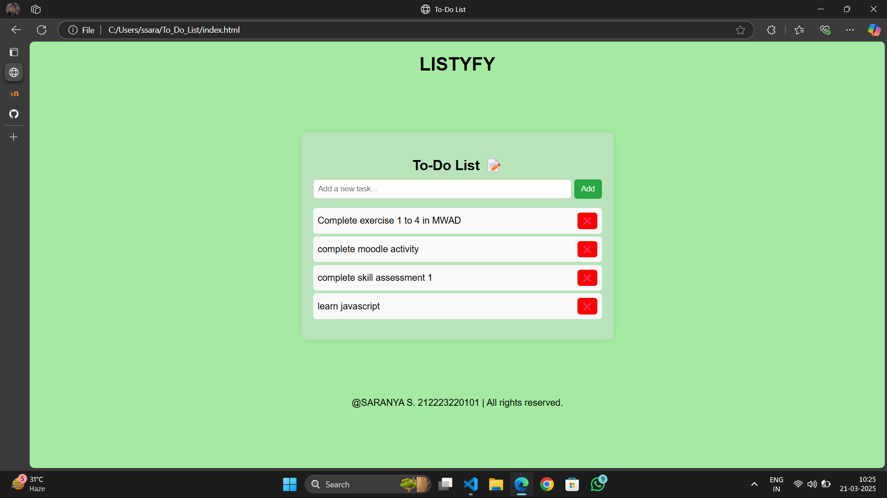

# Ex03 To-Do List using JavaScript
## Date:21-03-2025

## AIM
To create a To-do Application with all features using JavaScript.

## ALGORITHM
### STEP 1
Build the HTML structure (index.html).

### STEP 2
Style the App (style.css).

### STEP 3
Plan the features the To-Do App should have.

### STEP 4
Create a To-do application using Javascript.

### STEP 5
Add functionalities.

### STEP 6
Test the App.

### STEP 7
Open the HTML file in a browser to check layout and functionality.

### STEP 8
Fix styling issues and refine content placement.

### STEP 9
Deploy the website.

### STEP 10
Upload to GitHub Pages for free hosting.

## PROGRAM

HTML:

```
<!DOCTYPE html>
<html lang="en">
<head>
    <meta charset="UTF-8">
    <meta name="viewport" content="width=device-width, initial-scale=1.0">
    <title>To-Do List</title>
    <link rel="stylesheet" href="style.css">
</head>
<body>
    <h1>LISTYFY</h1>
    <div class="container">
        <h2>To-Do List 📝</h2>
        <div class="input-section">
            <input type="text" id="taskInput" placeholder="Add a new task...">
            <button onclick="addTask()">Add</button>
        </div>
        <ul id="taskList"></ul>
    </div>
    <script src="script.js"></script>
<footer>@SARANYA S. 212223220101 | All rights reserved.</footer>
</body>
</html>

```

CSS:

```
body {
    font-family: Arial, sans-serif;
    background: #a4eaa1fc;
    text-align: center;
}

.container {
    width: 500px;
    margin: 100px auto;
    padding: 20px;
    background: rgb(185, 228, 187);
    box-shadow: 0 0 10px rgba(0, 0, 0, 0.1);
    border-radius: 10px;
}
h2 {
    margin-bottom: 10px;
}
.input-section {
    display: flex;
    justify-content: space-between;
}
input {
    flex: 1;
    padding: 8px;
    border: 1px solid #e4b6b6;
    border-radius: 5px;
}
button {
    margin-left: 5px;
    padding: 8px 12px;
    border: none;
    background: #28a745;
    color: white;
    border-radius: 5px;
    cursor: pointer;
}
button:hover {
    background: #218838;
}
ul {
    list-style: none;
    padding: 0;
}
li {
    background: #f9f9f9;
    margin: 5px 0;
    padding: 8px;
    display: flex;
    justify-content: space-between;
    align-items: center;
    border-radius: 5px;
}
li.completed {
    text-decoration: line-through;
    color: gray;
}
.delete-btn {
    background: red;
    color: white;
    border: none;
    padding: 5px 8px;
    cursor: pointer;
    border-radius: 5px;
}
.delete-btn:hover {
    background: darkred;
}

```
JAVASCRIPT:

```

function addTask() {
    let taskInput = document.getElementById("taskInput");
    let taskText = taskInput.value.trim();

    if (taskText === "") {
        alert("Please enter a task!");
        return;
    }

    let taskList = document.getElementById("taskList");

    let li = document.createElement("li");
    li.innerHTML = `${taskText} 
        <button class="delete-btn" onclick="deleteTask(this)">❌</button>`;

    li.addEventListener("click", function() {
        li.classList.toggle("completed");
    });

    taskList.appendChild(li);
    taskInput.value = "";
}

function deleteTask(button) {
    let li = button.parentElement;
    li.remove();
}

```

## OUTPUT



## RESULT
The program for creating To-do list using JavaScript is executed successfully.
